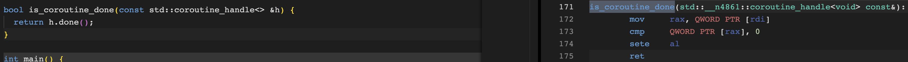
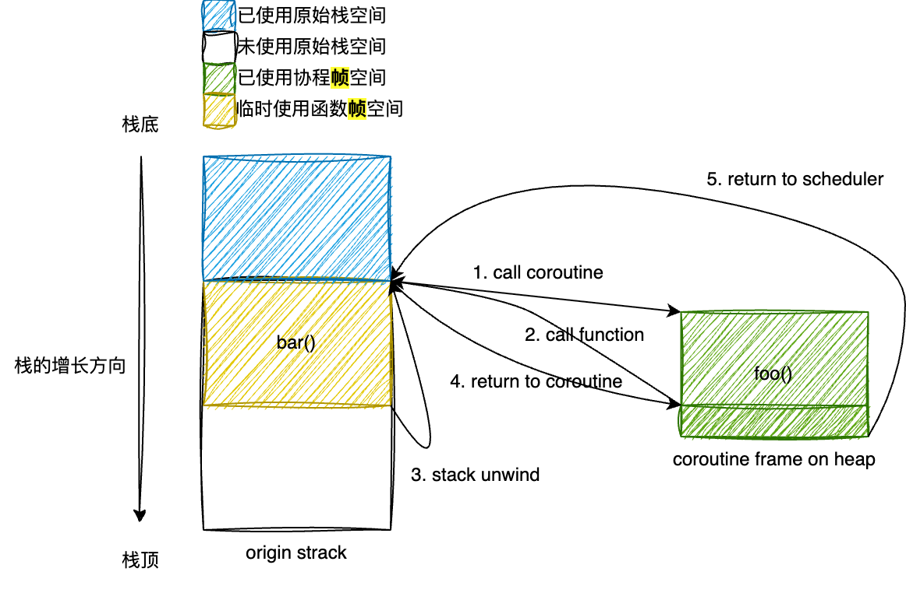
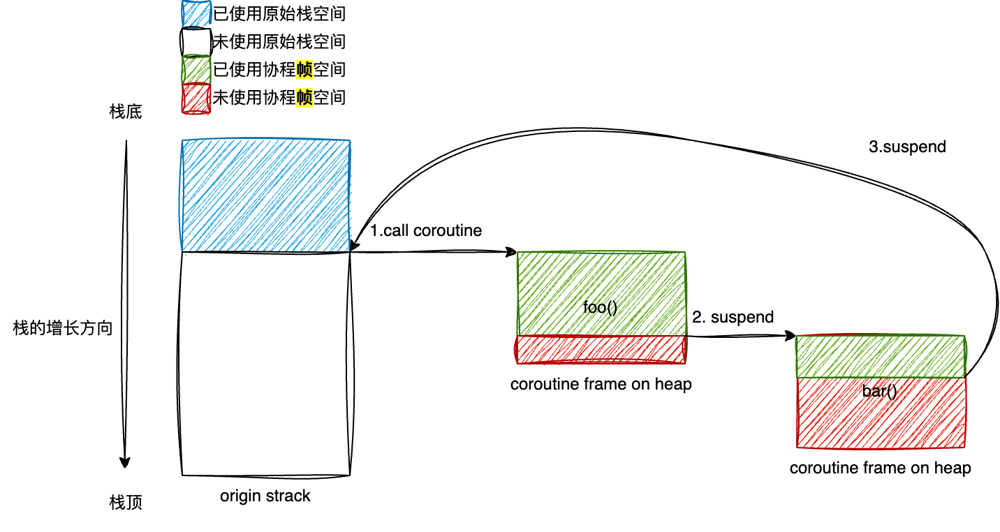
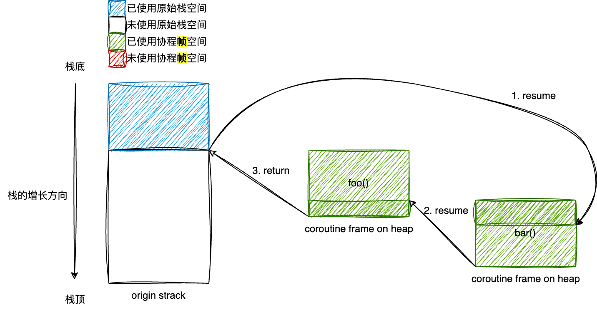
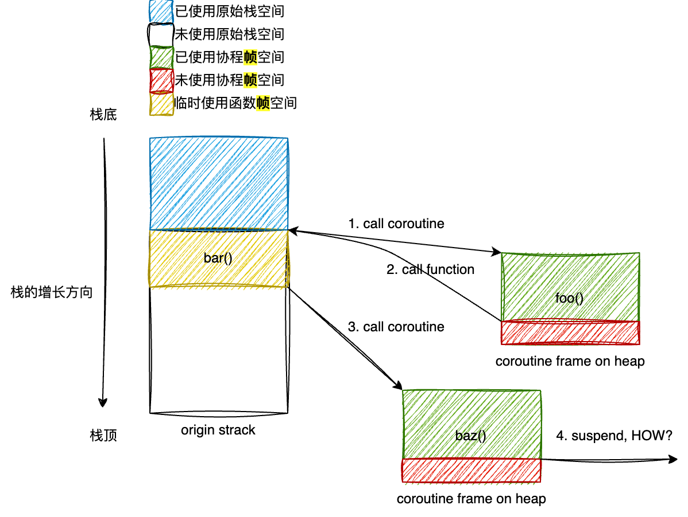
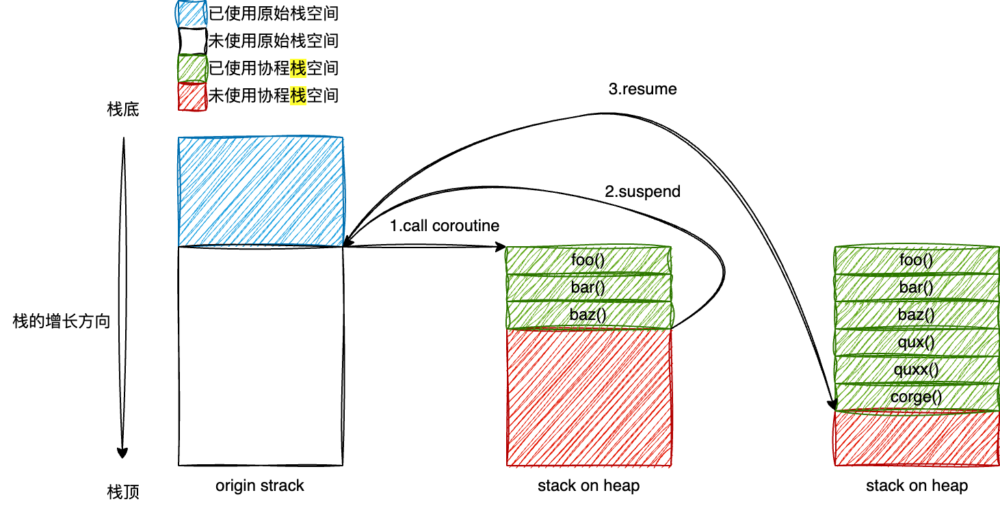

如果将构建大型复杂软件工程类比于建造一座精美绝伦的巨型建筑。  
那么用于建造这座建筑的工具与材料工艺，将很大程度上决定这座建筑的规模与精美程度的上限。  
在21世纪的今天，人类使用了一系列先进的工艺与工具，如钢筋混凝土、挖掘机、3D打印等，构建了如五角大楼、哈利法塔、大兴国际机场这样的雄伟建筑，同时还能兼具抗震、隔热、通风、排水等一系列功能。  
反观古代，纵是有千万苦力，代际相传，纵有榫卯、铁锤、上好的石材与砖瓦烧制工艺的加持，也无非是只能是造出个阿房宫，随着西楚霸王一声令下，便被付之一炬，一烬不存。

一个现代化战争中的士兵，尽管在体魄和力气上也许比不上古代的将军，但凭借其武装到牙齿的精良装备和战斗技巧，手持机关枪，腰挂手榴弹，肩扛火箭筒，身披防弹衣，占据险要地势，居高临下，面对古人持红缨枪的千军万马，仅凭其匹夫之勇，也未尝不可有一夫当关，万夫莫开之势？
# LearnCoroutine
CPP20无栈协程全解: 关于标准协程，你所需要知道的一切。
# -1. Why CPP20-coroutine?
笔者在一个超过百万行代码，超过百人协作开发的，高度性能敏感型的大型复杂软件工程的内核组工作了5年。  
从工作体验来讲，5年的高强度工作中，代码开发的占比相当有限，每天的精力至少有50%以上消耗在定位各种复杂问题上。  
尽管造成这一复杂困境的原因是多方面的，但我将工程技术标准、规范、和基础设施的落后归结于其中一个不可忽视的重要原因。  
而在工程技术标准、规范、和基础设施的落后这一矛盾中，异步逻辑的复杂描述方式又首当其冲占据主要矛盾地位。  
为了高效而被设计为异步的逻辑让模块的状态机变得相当复杂，并且在状态观测时经常伴随着追踪线索中断的情况，除了模块开发者的维护困难外，也不容易被观测者理解和追踪。  
在笔者写下本文的时间点（2025年），协程技术已经相当成熟，除了各种三方库外，cpp标准也在2020年发布了协程标准（由微软主导的提案），整个cpp生态在编译器和语法层面对协程进行了深度支持。  
尽管关于协程，目前的成熟的选择还有很多，但是"标准"往往意味着更多。  
笔者已经深度体会过在一个脱离了主流生态圈，闭关锁国，闭门造车的环境中，难以施展拳脚的困境。  
因此借用侯捷先生的一句话：“泰山北斗已现，又何必案牍劳形于墨翰书海之中！”  

“何哉？”  
”无它，唯其标准尔。“  

（尽管CPP20的无栈协程在可定制化、高性能、高效的内存管理上都具备优势（当然同时也带来了额外的复杂度），但在其作为"标准"的事实面前，笔者认为技术上的优势尚且次要，拥抱标准，跟进标准，基于标准去创新才能够让个人和组织在时代的滚滚浪潮中借势向前，而非如同飘荡在死海上的一叶扁舟，近凭一人一浆，纵然有万般力气也是步履维艰，寸步难行。）  
（CPP20的无栈协程并不被视为是一个业务发开者可以开箱即用的机制，而更多的被看作是协程库作者用于实现高性能，可扩展的协程框架的基本原语，因此本文专注于讲解CPP20无栈协程的工作细节，读者可以通过本文了解编译器处理协程魔法的背后发生了什么，也可以了解协程框架调度协程和实现协程嵌套的原理，但不应期望在阅读本文后可以开箱即用的将标准协程应用于自己的项目中。）

# 0. 让我们先从一个add函数讲起(example0.cpp)
一个add()函数，任何具有基本编程知识的人都能直观的理解这个函数的运行过程：
```cpp
// example0.cpp
#import <print>

int add(int a, int b) {
  return a + b;
}

int main() {
  int result = add(1,2);
  std::print("result:{}\n", result);
  return 0;
}
```
那么该如何将它改造成一个协程呢？  

# 1. 协程版本的add函数(example1.cpp)
观察example1.cpp中coro_add的定义：
```cpp
// example1.cpp
MyFuture coro_add(int a, int b) {
  co_return a + b;
}
```
[标准](https://en.cppreference.com/w/cpp/language/coroutines.html)规定, 只要函数体中存在任意的协程关键字：co_await/co_yield/co_return, 那么该函数将被编译器实现为一个协程（本文即试图向读者讲解，被“编译器实现为一个协程”到底意味着什么）：

> A function is a coroutine if its definition contains any of the following:
>  - the co_await expression — to suspend execution until resumed
>  - the co_yield expression — to suspend execution returning a value
>  - the co_return statement — to complete execution returning a value

对比`add()`函数的`return a + b;`，在`coro_add()`中，被换成了`co_return a + b;`，因为存在`co_return`关键字，`coro_add()`函数被编译器识别，并实现为一个协程。  
一个协程，具有挂起/恢复行为，可以在定制的执行点保存状态，并将控制权返回给上层，直到满足条件时，线程控制权可以再回到协程，从上次挂起点继续执行。  
在example1.cpp的例子中，协程实现尚且简单，`coro_add()`没有在中途的显式挂起行为，而是直接返回了结果。  
那么它的结果如何被外部接收呢？——这就要关注`coro_add()`函数的返回类型`MyFuture`了。
## 1.1 Future与Promise
Future/Promise模型是计算机领域通用的异步协同机制。  
如果你了解标准库的std::future/promise，需要与本节的概念区别开来以免混淆，尽管从概念上来讲，它们都是异步协同机制的具体行为描述，但std::future/promise描述的是“就某个值达成同步”的机制，而本节中谈论的Fututre/Promise特指对CPP20中的无栈协程的执行过程进行同步的机制。  
广义上来讲，Promis可以被认为是一个单次写的寄存器，而Future则是一个可以重复只读的寄存器句柄。  


在本节对于协程的讨论中，Promise是协程对外的结果存储结构，而Future则是外部用来与Promise交互的句柄结构。  
在example1.cpp的例子中，`coro_add()`返回值的类型为`MyFuture`，外部可以通过它来访问协程帧，检查协程的状态，控制协程的恢复行为，并在协程结束后通过其获取协程的执行结果。  
那么Promise呢？`coro_add()`的函数体和返回值都未体现出任何的Promise相关行为，`MyFuture`是怎么和Promise关联起来的呢？  
让我们来观察`MyFuture`的结构定义：
```cpp
class MyPromise;

struct MyFuture {
  using promise_type = MyPromise;
  // 构造函数接收协程句柄
  MyFuture(std::coroutine_handle<promise_type> h) : handle_(h) {}
  ~MyFuture() {
    if (handle_) {
      handle_.destroy(); // 释放资源
    }
  }
  std::coroutine_handle<promise_type> handle_;
};
```
标准规定：  
1. 一个Future对象和一个Promise对象相关联，编译器通过`Future::promise_type`来获取具体的Promise对象类型。
2. 一个Future对象的构造函数必须要接受一个std::coroutine_handle对象，该对象是协程执行的上下文结构，即“协程帧”。  

在`MyFuture`的定义中，使用了MyPromise作为实际的Promise类型，同时`MyFuture`的构造函数接受一个协程帧句柄，并将协程帧句柄保存在成员状态handle_中，它的析构函数会在协程帧有效时将其析构掉，以达成RAII语义。


接下来，我们观察MyPromise类型：
```cpp
struct MyPromise {
  std::suspend_never initial_suspend() noexcept { return {}; } // 协程创建后立即开始执行
  std::suspend_always final_suspend() noexcept { return {}; } // 协程结束时挂起
  auto get_return_object() { return MyFuture{std::coroutine_handle<MyPromise>::from_promise(*this)}; } // 标准写法，背下来
  void return_value(int value) { result_ = value; } // 存储协程执行的返回值，对应于"co_return a + b;"
  void unhandled_exception() { std::terminate(); } // 异常处理
  int result_;
};
```
标准规定：
1. Promise类型必须具备成员函数initial_suspend()，该函数的调用结果将决定协程帧在构造完成后是立即执行，还是先挂起并让出线程，等待后续的resume()动作再开始执行。
2. Promise类型必须具备成员函数final_suspend(), 该函数的调用结果将决定协程在函数体结束后，是挂起等待外部访问，还是不挂起直接销毁。
3. Promise类型必须具备成员函数get_return_object()，该函数描述了如何从Promise对象构造出一个Future对象的行为。（初学者无脑写：`Future{std::coroutine_handle<Promise>::from_promise(*this)};`）
4. Promise类型必须具备成员函数return_void() for `co_return;`形式的结束，或者return_value(expr) for `co_return expr;`形式的结束。(本例属于后者)
5. Promise类型必须具备成员函数unhandled_exception(), 描述当协程中出现未被捕获的异常时如何处理。(可以通过std::current_exception()获取当前异常)

在`MyPromise`的定义中：
1. 它规定了协程帧在初始化后立即执行，无需挂起。
2. 在执行结束后需要挂起，不可自动销毁。
3. 以默认方式从Promise结构中构建`MyFuture`对象。
4. 协程执行结束时的int结果存储在result_中。
5. 遇到任何未被捕获的异常直接终止程序。
# 1.2 编译器对coro_add的转换
有了Future与Promise，接下来让我们看看编译器是如何借助它们来处理coro_add()函数的，以伪代码作为示例，编译器将coro_add转换为如下代码：
```cpp
MyFuture coro_add(int a, int b) {
  <construct-coroutine-frame> // 后面再详细展开
  co_await promise.initial_suspend();
  try {
    co_return a + b;// -> promise.return_value(a + b);
  } catch (...) {
    promise.unhandled_exception();
  }
FinalSuspend:
  co_await promise.final_suspend();
}
```
可以看到，编译器在处理协程函数的时候，会在协程函数的初始化/析构/发生异常时调用用户的定制操作，而用户的定制逻辑已经在Promise类型中定义过了。  
上述转换是最简化转换逻辑，该逻辑中引入了两个关键字`co_await`以及`co_return`.  
`co_return`的处理方式很简单，前面提到，广义上来看，Promise是一个单次写寄存器，`co_return`描述的实际上就是这个协程函数对于Promise对象的最终写入行为。(也就是最终被转换为注释中的`promise.return_value(a + b)`)  
而`co_await`关键字相比之下更加复杂，理解`co_await`将是理解协程挂起机制的关键，让我们单独开辟一小节来讲解吧。
# 1.3 协程的挂起与恢复：理解co_await关键字及编译器的处理
编译器在处理`co_await <expr>`时，进行了如下伪代码转换(请读者仔细体会对co_await的伪代码转换，这对于理解cpp20的无栈协程机制至关重要！)：
```cpp
// 由编译器生成
co_await <expr>
{
  auto&& value = <expr>;
  auto&& awaitable = get_awaitable(promise, static_cast<decltype(value)>(value));
  auto&& awaiter = get_awaiter(static_cast<decltype(awaitable)>(awaitable));
  if (!awaiter.await_ready()) {//是否需要挂起协程
    using handle_t = std::coroutine_handle<P>;
    using await_suspend_result_t = decltype(awaiter.await_suspend(handle_t::from_promise(p)));
    <suspend-coroutine> //挂起协程(在另一个线程已经可以到用resume()来恢复这个协程了，无需额外的锁来保护)
    if constexpr (std::is_void_v<await_suspend_result_t>) {
      awaiter.await_suspend(handle_t::from_promise(p)); //异步(也可能同步)执行task
      <return-to-caller-or-resumer> //返回给caller
    } else if constexpr (std::is_same_v<await_suspend_result_t, bool>) {
      if (awaiter.await_suspend(handle_t::from_promise(p))) {
        <return-to-caller-or-resumer>
      }
    } else {
      auto&& other_coroutine = awaiter.await_suspend(handle_t::from_promise(p));
      other_coroutine.resume();
    }
    <resume-point> //task执行完成，恢复协程，这里是协程恢复执行的地方
  }
  return awaiter.await_resume(); //返回task结果
}
```
接来下咱们逐行拆分讲解上面这段伪代码。  
# 1.3.1 对co_await \<expr\>表达式的两步编译期转换
首先编译器对于\<expr\>进行了两步转换，也就是\<expr\> -> awaitable -> awaiter：
```cpp
// 由编译器生成
auto&& value = <expr>;
auto&& awaitable = get_awaitable(promise, static_cast<decltype(value)>(value));
auto&& awaiter = get_awaiter(static_cast<decltype(awaitable)>(awaitable));
```
这个过程主的目的是让用户拥有定制`co_await`关键字的能力，get_awaitable是一个标准库函数，它的实现伪代码是：
```cpp
// 由编译器生成
template <typename Promise, typename Expr>
decltype(auto) get_awaitable(Promise &promise, Expr &&expr) {
  if constexpr (requires { promise.await_transform(std::forward<Expr>(expr)); }) {
    return promise.await_transform(std::forward<Expr>(expr));
  } else {
    return std::forward<Expr>(expr);
  }
}
```
`get_awaitable()`伪代码逻辑采用了cpp20的concept特性来描述，对此尚无概念的同学可以直接这样理解：  
通过在`Promise`中添加`await_transform`定义可以对原始的\<expr\>进行定制转换，如果没有这个转换，`awaitable`将会是\<expr\>本身。  
在得到`awaitable`对象后，编译器将更进一步检查了操作符重载`operator co_await()`是否存在，以满足更进一步的定制需求：
```cpp
// 由编译器生成
template <typename Awaitable>
decltype(auto) get_awaiter(Awaitable &&awaitable) {
  if constexpr (has_member_operator_co_await_v<Awaitable &&>) {// awaitable重载了co_await运算符
    return std::forward<Awaitable>(awaitable).operator co_await();
  } else if (has_non_member_operator_co_await_v<Awaitable &&>) {// 全局co_await运算符针对awaitable类型进行了重载
    return operator co_await(std::forward<Awaitable>(awaitable))
  } else {// 否则返回awaitable对象本身
    return std::forward<Awaitable>(awaitable);
  }
}
```
值得注意的是，如果不存在定制行为，那么上述两步转换流程是编译器在编译期对\<expr\>进行的，没有运行时开销, 最终`co_await <expr>`表达式返回的`awaiter`对象就是\<expr\>本身。  
读者可能对于为何要引入这种深度定制机制存在疑惑，别急，在第五节中咱们将看到这种机制如何在协程间的链式调用过程中发挥作用。  
# 1.3.2 通过Awaiter定制挂起和恢复行为
接下来让我们把目光转向两步转换后的Awaiter：
```cpp
// 由编译器生成
if (!awaiter.await_ready()) {//是否需要挂起协程
    using handle_t = std::coroutine_handle<P>;
    using await_suspend_result_t = decltype(awaiter.await_suspend(handle_t::from_promise(p)));
    <suspend-coroutine> //挂起协程
    ......
    <resume-point> //task执行完成，恢复协程，这里是协程恢复执行的地方
  }
  return awaiter.await_resume(); //返回task结果
```
这里调用了awaiter的约定方法，即：
1. bool await_ready() : 表明协程等待的结果是否已经就绪，如果已经就绪则跳过挂起和恢复操作，否则——
2. void/bool/coroutine_handle await_suspend() ： 协程挂起前的行为，可以通过该函数定制挂起动作，返回类型用于编译器判断接下来的生成代码行为：  
```cpp
// 由编译器生成
{
  ......
    <suspend-coroutine> //挂起协程
    if constexpr (std::is_void_v<await_suspend_result_t>) {// 1. void返回类型表明await_suspend()调用完成后无条件挂起协程。
      awaiter.await_suspend(handle_t::from_promise(p));
      <return-to-caller-or-resumer>
    } else if constexpr (std::is_same_v<await_suspend_result_t, bool>) {// 2. bool返回类型将为挂起协程提供运行时判断依据。
      if (awaiter.await_suspend(handle_t::from_promise(p))) {
        <return-to-caller-or-resumer>
      }
    } else {// 3. coroutine_handle类型的返回值表示在挂起当前协程后，线程不返回caller而是直接恢复另一个协程。
      auto&& other_coroutine = awaiter.await_suspend(handle_t::from_promise(p));
      other_coroutine.resume();
    }
    <resume-point> //task执行完成，恢复协程，这里是协程恢复执行的地方
  ......
}
```
3. T await_resume() : 在协程恢复之后，该函数的返回值将作为co_await \<expr\>最终的结果。  
# 1.4 再回顾coro_add()
了解了编译器是如何处理Future/Promise，和co_return/co_await的细节后，咱们再回过头来看`coro_add()`函数就不难理解背后的细节了：  
```cpp
class MyPromise;

struct MyFuture {
  using promise_type = MyPromise;
  MyFuture(std::coroutine_handle<promise_type> h) : handle_(h) {} // 构造函数接收协程句柄
  ~MyFuture() {
    if (handle_) {
      handle_.destroy(); // 释放资源
    }
  }
  std::coroutine_handle<promise_type> handle_;
};

struct MyPromise {
  std::suspend_never initial_suspend() noexcept { return {}; } // 协程立即开始
  std::suspend_always final_suspend() noexcept { return {}; } // 协程结束时不挂起
  auto get_return_object() { return MyFuture{std::coroutine_handle<MyPromise>::from_promise(*this)}; } // 标准写法，背下来
  void return_value(int value) { result_ = value; } // 存储协程执行的返回值
  void unhandled_exception() { std::terminate(); } // 异常处理
  int result_;
};

MyFuture coro_add(int a, int b) {
  co_return a + b;
}
// from std:
// [coroutine.trivial.awaitables]
// struct suspend_never {
//   _LIBCPP_HIDE_FROM_ABI constexpr bool await_ready() const noexcept { return true; }
//   _LIBCPP_HIDE_FROM_ABI constexpr void await_suspend(coroutine_handle<>) const noexcept {}
//   _LIBCPP_HIDE_FROM_ABI constexpr void await_resume() const noexcept {}
// };

// struct suspend_always {
//   _LIBCPP_HIDE_FROM_ABI constexpr bool await_ready() const noexcept { return false; }
//   _LIBCPP_HIDE_FROM_ABI constexpr void await_suspend(coroutine_handle<>) const noexcept {}
//   _LIBCPP_HIDE_FROM_ABI constexpr void await_resume() const noexcept {}
// };
```
`std::suspend_never`是标准库提供的一个不触发任何异步操作，表明在`co_await`点不挂起协程的默认awaitable定义。  
`std::suspend_always`则是标准库提供的一个不触发任何异步操作，表明在`co_await`直接挂起协程的默认awaitable定义。  
因此在main()函数调用coro_add()时:
```cpp
int main() {
  MyFuture coro_future = coro_add(1, 2);
  std::print("Result: {}\n", coro_future.handle_.promise().result_);
  return 0;
}
```
1. 首先构建了coro_add的协程帧。（构建的详细过程在下一节中展开）
2. 构建完协程帧后，因为看到std::suspend_always的await_ready()恒为true，因此跳过了协程帧的挂起操作。（编译期跳过）
3. 执行了a + b操作，并调用了promise.return_value()将其存入了promise对象中。
4. 在协程退出之前，因为看到了std::suspend_nevenr的await_ready()恒为false，因此调用了suspend_never的await_suspend动作（空动作，没有触发任何异步行为），并挂起了协程。
5. 在main函数中借助std::print将promise中存储的结果打印到了标准输出上。
6. 随着main函数退出，coro_future对象析构，其RAII语义一并析构了协程帧以及所有相关的状态。

借助example1.cpp啃透这一节的内容，我想读者应该对协程的创建/销毁/挂起/恢复过程以及编译器在用户代码背后的转换操作有了一定的认识，下一节中咱们重点关注协程帧对象内部的状态。
# 2 协程帧内存布局（example2.cpp）
先说结论，在使用clang编译的测试程序中，协程帧的memory layout是这个样子的：
| coroutine_handle<promise_type> | sizeof |
| :---: | :---: |
| resume_fn(frame_ptr*)  | pointer size (8 bytes in commin) |
| destroy_fn(frame_ptr*) | pointer size (8 bytes in common) |
| promise_type | sizeof(promise type) |
| 协程实参 | sizeof(args...) |
| 协程局部变量 | depends |
| 协程状态 | 4 bytes in test |

相对于example1.cpp，example2.cpp添加了一些额外改动，以方便读者理解协程帧的内存布局和协程被调度时的内部状态变化，具体如下：
```cpp
// example2.cpp
...
#pragma pack(4) // 内存字段pending的粒度从默认的8字节调整为4字节，以便更紧凑的打印出内存段的内容
void *CORO_FRAME_PTR = nullptr; // 将分配出来的协程帧内存起始地址记录到全局变量中
size_t CORO_FRAME_SIZE = 0; // 将分配出来的协程帧内存大小记录到全局变量中
inline void print_memory_content(const std::source_location &loc = std::source_location::current()); // 打印协程帧内存的全部二进制内容
...
struct MyPromise {
  static void *operator new(std::size_t size) { // 通过定制MyPromise的的new操作符可以定制协程帧的内存分配方式
    CORO_FRAME_PTR = std::malloc(size);
    if (CORO_FRAME_PTR == nullptr) {
      throw std::bad_alloc();
    }
    CORO_FRAME_SIZE = size;
    std::print("call promise_type::operator new to alloc memory, addr:{:p}, size:{:d}\n", CORO_FRAME_PTR, CORO_FRAME_SIZE);
    return CORO_FRAME_PTR;
  }
  ...
  std::suspend_always initial_suspend() noexcept { print_memory_content(); return {}; } // 初始化协程后，打印协程内存状态并挂起协程
  std::suspend_always final_suspend() noexcept { print_memory_content(); return {}; } // 协程执行完毕后，打印协程内存状态并挂起协程
  ...
  int32_t result_ = 0x11111111; // 使用magic number在二进制内存中标记promise变量的位置
};
...
auto empty_suspend_operation() { // 该函数用于让coro_add可以在执行中途挂起，以便观测协程帧内存状态
  struct {
    bool await_ready() const noexcept { return false; }
    void await_suspend(std::coroutine_handle<>) const { print_memory_content(); } // 每次通过empty_suspend_operation挂起协程时打印协程帧的内存状态
    void await_resume() const noexcept {}
    int32_t flag_ = 0x22222222; // 使用magic number在二进制内存中标记awaitable的位置
  } ret;
  return ret;
}
...
MyFuture coro_add(int a, int b) { // 为coro_add增加额外的内存状态，并经历额外的挂起和恢复流程
  int32_t var_in_coroutine = 0x33333333;
  co_await empty_suspend_operation();
  co_await empty_suspend_operation();
  co_await empty_suspend_operation();
  co_return a + b;
}
...
int main() {
  MyFuture coro_future = coro_add(1, 2);
  while (!coro_future.handle_.done()) coro_future.handle_.resume(); // 不断恢复协程运行，直至协程执行结束最终挂起
  print_memory_content(); // 在协程析构前最后打印一次协程的内存内容
  std::print("Result: {}\n", coro_future.handle_.promise().result_);
  return 0;
}
```
在example2.cpp编译运行后，协程coro_add()将经历5次挂起动作，分别是：
1. 初始化成功后通过init_suspend()挂起。
2. 在协程执行过程中，通过co_await empty_suspend_operation()挂起 x 3。
3. 协程退出后通过final_suspend()挂起。

main函数退出前也最后一次打印了协程帧的状态。  
这5次挂起时打印 + 1次退出后观测，协程帧的内存状态分别是：
```
 ./build_debug/example2
call promise_type::operator new to alloc memory, addr:0x16e83820, size:48
print at: std::suspend_always MyPromise::initial_suspend():line 55, addr:0x16e83820, size:48:
0x16e83820:     0x00408e48      0x00000000      0x00409408      0x00000000
0x16e83830:     0x11111111      0x00000001      0x00000002      0x00000000
0x16e83840:     0x00000000      0x00000000      0x00000000      0x00000000
print at: void empty_suspend_operation()::(anonymous struct)::await_suspend(std::coroutine_handle<>) const:line 66, addr:0x16e83820, size:48:
0x16e83820:     0x00408e48      0x00000000      0x00409408      0x00000000
0x16e83830:     0x11111111      0x00000001      0x00000002      0x33333333
0x16e83840:     0x22222222      0x00000000      0x00000000      0x00000001
print at: void empty_suspend_operation()::(anonymous struct)::await_suspend(std::coroutine_handle<>) const:line 66, addr:0x16e83820, size:48:
0x16e83820:     0x00408e48      0x00000000      0x00409408      0x00000000
0x16e83830:     0x11111111      0x00000001      0x00000002      0x33333333
0x16e83840:     0x22222222      0x22222222      0x00000000      0x00000002
print at: void empty_suspend_operation()::(anonymous struct)::await_suspend(std::coroutine_handle<>) const:line 66, addr:0x16e83820, size:48:
0x16e83820:     0x00408e48      0x00000000      0x00409408      0x00000000
0x16e83830:     0x11111111      0x00000001      0x00000002      0x33333333
0x16e83840:     0x22222222      0x22222222      0x22222222      0x00000003
print at: std::suspend_always MyPromise::final_suspend():line 56, addr:0x16e83820, size:48:
0x16e83820:     0x00408e48      0x00000000      0x00409408      0x00000000
0x16e83830:     0x00000003      0x00000001      0x00000002      0x33333333
0x16e83840:     0x22222222      0x22222222      0x22222222      0x00000003
print at: int main():line 84, addr:0x16e83820, size:48:
0x16e83820:     0x00000000      0x00000000      0x00409408      0x00000000
0x16e83830:     0x00000003      0x00000001      0x00000002      0x33333333
0x16e83840:     0x22222222      0x22222222      0x22222222      0x00000004
Result: 3
```
# 2.1 协程初始化后的第一次挂起 (initial_suspend)
```
print at: std::suspend_always MyPromise::initial_suspend():line 55, addr:0x16e83820, size:48:
0x16e83820:     0x00408e48      0x00000000      0x00409408      0x00000000
0x16e83830:     0x11111111      0x00000001      0x00000002      0x00000000
0x16e83840:     0x00000000      0x00000000      0x00000000      0x00000000
```
将协程帧的起始地址`0x16e83820`记作`coro_addr`.  
可以看到内存段`coro_addr + 0`和`coro_addr + 8`的位置分别为两个函数指针。  
在binary中可以直接搜索这两个位置对应的汇编指令内容，对应的操作就是对resume和destroy函数的调用：
```
❯ objdump -d ./build_debug/example2 | grep -A 10 '00408e48'
0000000000408e48 <_Z8coro_addii.resume>:
  408e48:       d10343ff        sub     sp, sp, #0xd0
  408e4c:       a90c7bfd        stp     x29, x30, [sp, #192]
  408e50:       910303fd        add     x29, sp, #0xc0
  408e54:       f81d03a0        stur    x0, [x29, #-48]
  408e58:       f81f83a0        stur    x0, [x29, #-8]
  408e5c:       14000153        b       4093a8 <_Z8coro_addii.resume+0x560>
  408e60:       14000001        b       408e64 <_Z8coro_addii.resume+0x1c>
  408e64:       14000001        b       408e68 <_Z8coro_addii.resume+0x20>
  408e68:       52800028        mov     w8, #0x1                        // #1
  408e6c:       37000168        tbnz    w8, #0, 408e98 <_Z8coro_addii.resume+0x50>
❯ objdump -d ./build_debug/example2 | grep -A 10 '00409408'
0000000000409408 <_Z8coro_addii.destroy>:
  409408:       d10343ff        sub     sp, sp, #0xd0
  40940c:       a90c7bfd        stp     x29, x30, [sp, #192]
  409410:       910303fd        add     x29, sp, #0xc0
  409414:       f81d03a0        stur    x0, [x29, #-48]
  409418:       f81f83a0        stur    x0, [x29, #-8]
  40941c:       1400015d        b       409990 <_Z8coro_addii.destroy+0x588>
  409420:       14000001        b       409424 <_Z8coro_addii.destroy+0x1c>
  409424:       14000001        b       409428 <_Z8coro_addii.destroy+0x20>
  409428:       2a1f03e8        mov     w8, wzr
  40942c:       37000168        tbnz    w8, #0, 409458 <_Z8coro_addii.destroy+0x50>
```
在`coro_addr + 16`的位置内容为0x11111111，这是MyPromisele类型的magic number，可见promise对象就存储在这个位置。  
接下来`coro_addr + 20`和`coro_addr + 24`的内容分别为1和2，也就是对应coro_add()函数调用时传进来的两个实参。  
其余的内存位置，从`[coro_addr + 28, coro_addr + 48)`均为0，目前还不好区分它们的内容。
# 2.2 协程的第二次挂起（co_await）
```
print at: void empty_suspend_operation()::(anonymous struct)::await_suspend(std::coroutine_handle<>) const:line 66, addr:0x16e83820, size:48:
0x16e83820:     0x00408e48      0x00000000      0x00409408      0x00000000
0x16e83830:     0x11111111      0x00000001      0x00000002      0x33333333
0x16e83840:     0x22222222      0x00000000      0x00000000      0x00000001
```
在协程第二次挂起，也就是第一次执行到co_await语句时，栈上变量var_in_coroutine已经经历了初始化动作，因此可以在`coro_addr + 28`位置观察到magic number=0x33333333。  
之后，在编译器背后进行的co_await语句的两步转换动作中，实际上生成了一个栈上的awaitable对象（对应empty_suspend_operation()），也就是`coro_addr + 32`位置的magic number=0x22222222。  
最后，当协程挂起后，协程的恢复点被更新到协程帧的最后，也就是`coro_addr + 44`位置状态：0 -> 1。
# 2.3 协程的第三次挂起（co_await）
```
print at: void empty_suspend_operation()::(anonymous struct)::await_suspend(std::coroutine_handle<>) const:line 66, addr:0x16e83820, size:48:
0x16e83820:     0x00408e48      0x00000000      0x00409408      0x00000000
0x16e83830:     0x11111111      0x00000001      0x00000002      0x33333333
0x16e83840:     0x22222222      0x22222222      0x00000000      0x00000002
```
在协程第三次挂起，也就是第二次执行co_await语句时，又生成了一个新的awaitable对象，可以看到`coro_addr + 34`位置的magic number=0x22222222。  
并且，协程的挂起位点再次更新，`coro_addr + 44`位置的状态：1 -> 2。
# 2.4 协程的第四次挂起（co_await）
```
print at: void empty_suspend_operation()::(anonymous struct)::await_suspend(std::coroutine_handle<>) const:line 66, addr:0x16e83820, size:48:
0x16e83820:     0x00408e48      0x00000000      0x00409408      0x00000000
0x16e83830:     0x11111111      0x00000001      0x00000002      0x33333333
0x16e83840:     0x22222222      0x22222222      0x22222222      0x00000003
```
同上一次挂起流程，在`coro_addr + 38`位置的创建了新的awaitable对象，并且更新了`coro_addr + 44`位置的状态：2 -> 3。  
# 2.5 协程的第五次挂起（final_suspend）
```
print at: std::suspend_always MyPromise::final_suspend():line 56, addr:0x16e83820, size:48:
0x16e83820:     0x00408e48      0x00000000      0x00409408      0x00000000
0x16e83830:     0x00000003      0x00000001      0x00000002      0x33333333
0x16e83840:     0x22222222      0x22222222      0x22222222      0x00000003
```
第五次挂起是协程帧的最后一次挂起，通过co_return将协程最终结果存储到了promise对象中，也就是修改了`coro_addr + 16`的状态：0x11111111 -> 3
# 2.6 对协程的最后一次观测
```
print at: int main():line 84, addr:0x16e83820, size:48:
0x16e83820:     0x00000000      0x00000000      0x00409408      0x00000000
0x16e83830:     0x00000003      0x00000001      0x00000002      0x33333333
0x16e83840:     0x22222222      0x22222222      0x22222222      0x00000004
```
在main函数退出前，对已经被标记为'done'状态的协程作了最后一次内存观测动作，可以看到相比于上一次观测，协程帧初始位置的resume_fn()函数指针被清空了。  
在clang的编译器处理中，std::coroutine_handle\<T\>::done()就是通过观测协程帧的首个8字节是否为0来判断协程是否结束的：

# 2.7 小结
example2.cpp在example1.cpp的基础上，增加了内存观测手段，并通过在协程关键位置对协程帧状态的观测，可以得知如下事实：
1. 整个协程帧都分配在堆内存上，是一整块连续的内存，并且其大小可在编译期得知。
2. 协程帧存储了协程函数的恢复操作和销毁操作的指针。
3. 协程函数的入参和栈上变量也都存储在协程帧中。
4. co_await关键字隐式生成的awaitable和awaiter对象也存储在协程帧中。
5. 协程帧保留了自身的挂起点的状态，在每一个挂起点都会更新这个状态，等同于一个手写的switch-case状态机。
6. 协程帧结束后，会清空协程帧的首八个字节（对应resume_fn）（clang编译器），以标记协程帧的结束。
# 3 co_yield关键字（example3.cpp）
在编译器眼中:
```cpp
co_yield expr;
```
只是单纯的被变换为了：
```cpp
co_await promise.yield_value(expr);
```
因此一个具有co_yield关键字的协程函数，其promise_type需要具备成员函数`yield_value(expr)`，以及，典型情况下其返回值通常为`std::suspend_always`。

既然已经有了co_await，并且co_yield仅仅是一个单纯的语法包装，那么为什么标准还需要单独抽象出来这么一个关键字呢？  
原因在于这种抽象场景的应用实在太过于广泛，以至于让标准委员会觉得这种抽象配在标准中独占一个关键字，这种场景被称为——“generator“。  
以斐波那契数列的生成器为例：
```cpp
// example3.cpp
struct FibGenerator {
  using promise_type = MyPromise;
  // 构造函数接收协程句柄
  FibGenerator(std::coroutine_handle<promise_type> h) : handle_(h) {}
  ~FibGenerator() {
    if (handle_) {
      handle_.destroy(); // 释放资源
    }
  }
  int generate_value();
  std::coroutine_handle<promise_type> handle_;
};
...
int FibGenerator::generate_value() {
  handle_.resume();
  return handle_.promise().current_value_;
}
```
这里将Future命名替换为了FibGenerator，为它增加了一个generate_value()函数调用，其余与上文中的Future保持一致。
```cpp
// example3.cpp
struct MyPromise {
  ...
  std::suspend_always yield_value(int value) { current_value_ = value; return {}; }
  int current_value_;
};
```
MyPromise类型与上文也并无不同，只是增加了一个yielde_value()成员函数，以和co_yield关键字关联。
而真正的协程逻辑描述在协程函数中：  
```cpp
FibGenerator coro_generate_fibo() {
  int a = 1;
  int b = 1;
  int new_value = 0;
  co_yield a;
  co_yield b;
  while (true) {
    co_yield (new_value = a + b);
    a = b;
    b = new_value;
  }
  co_return; // never reach
}

int main() {
  auto gen = coro_generate_fibo();
  std::cout << 1 << std::endl;
  for (int i = 0; i < 10; ++i) {
    std::cout << gen.generate_value() << std::endl; 
  }
  return 0;
}
```
这个例子运行后将会生成斐波那契数列的前十项。  
由于`coro_generate_fibo()`是一个while (true)的状态机，因此在不溢出的情况下它可以无限生成下去。  
# 4 协程框架简易原理(Scheduler/AsyncWorker) (example4.cpp)
接下来让咱们把视角从协程本身转移向协程之外的地方——协程的调度者scheduler，以及协程的异步操作执行者async_worker。  
example4.cpp引入了这两个角色的简易玩具实现，但原理上任何无栈协程框架都应该是趋同的，只要理解了本例，相信读者就会对协程的调度原理有了基本的认识：
```cpp
// example4.cpp
struct AsyncWorker {
  AsyncWorker() : stop_flag_(false) {
    new (&thread_) std::jthread([this]() {
      while (true) {
        std::function<void()> task;
        {
          std::unique_lock lk(lock_);
          cv_.wait(lk, [this]{ return stop_flag_ || !task_queue_.empty(); });
          if (stop_flag_) {
            break;
          } else {
            task = std::move(*task_queue_.begin());
            task_queue_.pop_front();
          }
        }
        task();
      }
    });
  }
  ~AsyncWorker() { thread_.join(); }
  static AsyncWorker &get_instance() {
    static AsyncWorker async_worker;
    return async_worker;
  }
  template <typename Function>
  void append_task(Function &&function) {
    std::lock_guard<std::mutex> lg(lock_);
    task_queue_.push_back(std::forward<Function>(function));
    cv_.notify_all();
  }
  void stop() {
    std::lock_guard lk(lock_);
    stop_flag_ = true;
    cv_.notify_all();
  }
private:
  bool stop_flag_;
  std::jthread thread_;
  std::mutex lock_;
  std::condition_variable cv_;
  std::list<std::function<void()>> task_queue_;
};
```
`AsyncWorker`是一个全局单例的任务消费者，通过`append_task()`接口来接收任务，存储到task_queue_中，并通过条件变量唤醒worker线程取任务执行。  
值得注意的是，异步操作大多与IO有关，很多情况下我们并不需要一个用户态的AyncWorker，操作系统、特种硬件或者三方库将承担这一职责。
```cpp
// example4.cpp
struct MyCoroScheduler {
  using CoroHandle = std::coroutine_handle<MyPromise>;
  static MyCoroScheduler &get_instance() {
    static MyCoroScheduler scheduler;
    return scheduler;
  }
  void init(const std::initializer_list<MyFuture *> &initializer_list) {
    for (auto &my_future : initializer_list) {
      await_ready_queue_.push_back(my_future->handle_);
    }
    total_running_task_size_ = initializer_list.size();
  }
  void append_await_ready_task(CoroHandle handle) { // 当协程异步操作完成时，通过本接口将协程返回给Scheduler
    std::lock_guard<std::mutex> lg(lock_);
    await_ready_queue_.push_back(handle);
    cv_.notify_all();
  }
  void event_loop() { // 主线程将陷在事件循环中，直至所有协程结束为止
    while (total_running_task_size_ > 0) {
      CoroHandle fetched_ready_coro;
      {
        std::unique_lock lk(lock_);
        cv_.wait(lk, [this]{ return !await_ready_queue_.empty(); });
        fetched_ready_coro = *await_ready_queue_.begin();
        await_ready_queue_.pop_front();
      }
      fetched_ready_coro.resume();
      if (fetched_ready_coro.done()) {
        total_running_task_size_--;
      }
    }
  }
private:
  mutable std::mutex lock_;
  std::condition_variable cv_;
  std::list<CoroHandle> await_ready_queue_;
  std::list<CoroHandle> done_queue_;
  int64_t total_running_task_size_;
};
```
`MyCoroScheduler`在init()时接收多个协程Future对象，并将它们存储到await_ready_queue_队列中。  
之后主线程通过调用event_loop()来实现多个线程的循环调度，直至所有协程执行结束为止。  
```cpp
// example4.cpp
...
auto async_get_input() {
  struct AwaitGetStdInput {
    constexpr bool await_ready() const noexcept { return false; }
    void await_suspend(std::coroutine_handle<MyPromise> handle) {
      AsyncWorker::get_instance().append_task([this, handle]() {
        std::cin >> this->input_value_;
        MyCoroScheduler::get_instance().append_await_ready_task(handle);
      });
    }
    int64_t await_resume() const { return input_value_; }
    int64_t input_value_;
  } awaiter;
  return awaiter;
}

MyFuture coro_add() {
  int64_t a = co_await async_get_input();
  int64_t b = co_await async_get_input();
  co_return a + b;
}
...
```
协程函数通过异步操作在标准输入中获取用户输入的值，获取两次，并将它们相加，作为协程的最终返回值。  
在这个过程中，协程函数将会挂起两次，并触发两次异步数据获取动作。  
当协程函数挂起时，它向AsyncWorker提交了一个异步任务，任务中保存了本协程帧句柄，当获取到用户输入后，协程帧句柄将返回到`MyCoroScheduler`，执行`event_loop()`等待条件变量的线程将被唤醒，并继续在上次的挂起点执行协程函数。

最终通过main函数来同时调度两个协程函数：
```cpp
...
// example4.cpp
int main() {
  MyFuture future1 = coro_add();
  MyFuture future2 = coro_add();
  MyCoroScheduler::get_instance().init({&future1, &future2});
  MyCoroScheduler::get_instance().event_loop();
  std::print("Result1: {}\n", future1.handle_.promise().result_);
  std::print("Result2: {}\n", future2.handle_.promise().result_);
  AsyncWorker::get_instance().stop();
  return 0;
}
// stdout
// ❯ ./build_release/example4
// 1
// 2
// 3
// 4
// Result1: 4
// Result2: 6
```
可以看到两个协程函数在获取输入的过程中，是交替获取的，这体现了scheduler在event_loop()中的对协程的交替调度过程。
# 5 协程与其他协程/普通函数的互调用（example5.cpp）
# 5.1 协程调用普通函数
根据前面的内容，相信读者已经对协程内部的内存布局、协程对象本身的堆内存属性，以及外围框架对协程的调度过程有了认识，在本节中咱们重点关注协程与其他协程/普通函数的交互流程。  
首先从协程调用普通函数的流程讲起:  

1. call coroutine:  
在scheduler中调用了一个协程函数foo()，那么将会在堆上开辟出一块协程帧用于foo()的执行。
2. call function:  
在foo()协程中调用了bar()函数，bar()作为一个普通函数它使用当前线程的栈空间作为函数帧。
3. stack unwind:  
由于bar()不具备挂起能力，因此它只是“一个短暂的瞬间”，当它结束后，它的函数帧从栈上被弹出，栈空间也被释放回到原点。
4. return to coroutine:  
bar()函数结束后，线程控制权回到foo()协程帧内并继续执行直至foo()挂起或者结束。
5. return to scheduler:  
在图示中foo()没有额外的挂起点，因此它直接执行到结束，将协程返回值同线程控制权返回给了scheduler。

# 5.2 协程调用协程 - 挂起
接下来咱们看更复杂一些的场景，如果bar()也是一个协程且会中途挂起，那么foo() -> bar()的调用过程会怎么样：  

1. call coroutine:  
如上图所示，在普通函数中调用协程时，将在堆上创建出一个新的foo()的协程帧，操作的内存地址将从原始的栈空间转移到堆上。
2. suspend:  
当foo()执行到一半需要调用另一个协程对象bar()时，将在堆上创建出一个新的bar()的协程帧，foo()的协程帧挂起，线程控制权转移到bar()的协程帧中。
3. suspend:  
当bar()执行到一半需要等待一个异步操作完成时，bar()的协程帧挂起，线程控制权转移回栈上。  

# 5.2 协程调用协程 - 恢复
接下来咱们看从scheduler恢复已挂起的嵌套协程：  

1. resume:  
在栈上保存了协程调用链的“根句柄”，通过“根句柄”恢复协程帧时，将直接恢复最深的协程帧，也就是bar()。(在稍后的example5.cpp中读者可以理解"根句柄"的实现)。
2. resume:  
当bar()执行结束后，区别于通常的挂起动作，如果它知道自己是被其他协程调用的，那么它将会把控制流回退给调用它的协程，也就是回到foo()中。
3. return:  
foo()继续执行协程帧中的内容，当执行结束后它将结果返回给scheduler。  


所以协程的嵌套调用其实就是多个堆上的协程帧以链表的方式串联到一起的形式，当恢复嵌套协程时，恢复链表的最末端协程帧，每个协程帧将存在两个不同的挂起动作：
1. 中途挂起，控制权直接回到scheduler。
2. 执行完毕挂起，控制权回到父协程。

# 5.3 实现协程间的链式调用示例——详解example5.cpp
首先来定义`LinkedCoroutine`结构将协程帧串联起来：
```cpp
// example5.cpp
struct LinkedCoroutine {
  LinkedCoroutine() : prev_(this), next_(this), handle_() {};
  LinkedCoroutine(const LinkedCoroutine &) = delete;
  LinkedCoroutine &operator=(const LinkedCoroutine &) = delete;
  ~LinkedCoroutine() {
    prev_ = nullptr;
    next_ = nullptr;
  }
  bool empty() { return prev_ == this; }
  void link_next(LinkedCoroutine &new_coroutine) {
    LinkedCoroutine *tmp_next = next_;
    next_ = &new_coroutine;
    new_coroutine.next_ = tmp_next;
    new_coroutine.prev_ = this;
    tmp_next->prev_ = &new_coroutine;
  }
  void remove_self() {
    LinkedCoroutine *tmp_prev = prev_;
    LinkedCoroutine *tmp_next = next_;
    if (!empty()) {
      tmp_prev->next_ = tmp_next;
      tmp_next->prev_ = tmp_prev;
      next_ = nullptr;
      prev_ = nullptr;
    }
  }
  LinkedCoroutine *prev_;
  LinkedCoroutine *next_;
  std::coroutine_handle<> handle_;
};
```
`LinkedCoroutine`在持有`std::coroutine_handle`协程帧句柄的前提下，通过新增prev_和next_成员指针将协程帧以双向链表的方式串联。  
注意这里`LinkedCoroutine`并不具备值语义和RAII语义，仅作为串联结构结构存在。  
接下来定制`MyFuture`句柄结构，它具备移动语义和RAII语义：  
```cpp
template <typename Ret>
struct MyFuture {
  using return_type = Ret;
  using promise_type = MyPromise<Ret>;
  MyFuture(std::coroutine_handle<promise_type> h) : promise_(&h.promise()) {}
  MyFuture(const MyFuture<Ret> &) = delete; // disallow copy
  MyFuture<Ret> &operator=(const MyFuture<Ret> &) = delete; // disallow copy
  MyFuture(MyFuture<Ret> &&rhs) : promise_(rhs.promise_) { rhs.promise_ = nullptr; } // allow move
  MyFuture<Ret> &operator=(MyFuture<Ret> &&rhs) { new (this) MyFuture(rhs); return *this; } // allow move
  ~MyFuture();
  void resume();
  bool done();
  Ret &get_result();
  promise_type *promise_;
};
...
template <typename Ret>
MyFuture<Ret>::~MyFuture() {
  if (promise_) {
    promise_->coro_handle_.handle_.destroy();
  }
}
template <typename Ret>
void MyFuture<Ret>::resume() {
  LinkedCoroutine &linked_handle = promise_->coro_handle_;
  if (linked_handle.empty()) {
    log("resume frame {:p}", linked_handle.handle_.address());
    linked_handle.handle_.resume();
  } else {
    log("resume frame {:p}", linked_handle.prev_->handle_.address());
    linked_handle.prev_->handle_.resume();
  }
}
template <typename Ret>
bool MyFuture<Ret>::done() {
  return promise_->coro_handle_.handle_.done();
}
template <typename Ret>
Ret &MyFuture<Ret>::get_result() {
  return promise_->result_;
}
```
这里重点关注`MyFuture::resume()`动作，与前文不同的是，`MyFuture`并没有直接记录协程帧，而是记录了`Promse`指针，在协程的恢复动作中，通过Promise指针找到了上文中串联在一起的协程调用链。  
恢复时判断调用链是否为空，如果调用链有效，直接恢复尾协程帧，否则恢复Promise所在的协程帧本身。  
接下来看`MyPromise`的实现：  
```cpp
// example5.cpp
template <typename MyFuture>
concept ValidFuture = requires {
  typename MyFuture::return_type;
  typename MyFuture::promise_type;
};

template <typename Ret>
struct MyPromise {
  ...
  std::suspend_always initial_suspend() noexcept { return {}; }
  FinalAwaitable final_suspend() noexcept { return {coro_handle_}; }
  void unhandled_exception() { std::abort(); } // 异常处理
  template <typename MyFuture, std::enable_if_t<ValidFuture<MyFuture>, bool> = false>
  MiddleAwaitable<typename MyFuture::return_type> await_transform(MyFuture &&task) {
    coro_handle_.link_next(task.promise_->coro_handle_);
    return {std::move(task)};
  }
  template <typename Others, std::enable_if_t<!ValidFuture<Others>, bool> = false>
  auto await_transform(Others &&others) { return std::forward<Others>(others); }
  auto get_return_object() { return MyFuture{std::coroutine_handle<MyPromise<Ret>>::from_promise(*this)}; }
  void return_value(int value) { result_ = value; }
  Ret result_;
  LinkedCoroutine coro_handle_;
};
```
与前文中的`MyPromise`定义相比，这里增加了更多的定制细节：  
1. 在final_suspend()中，返回值是一个定制的Awaitable对象——FinalAwaitable。  
2. 定制了额外的await_transform动作以配合编译器的"两步编译期转换"，在转换时如果等待对象是一个MyFutue对象，需要将该对象的协程帧串联到本协程帧的后面，否则原封不动的完美转发原对象。
3. co_await的等待结果被转换为了MiddleAwaitable对象。  

最后咱们关注MiddleAwaitable以及FinalAwaitable：
```cpp
// example5.cpp
template <typename Ret>
struct MyPromise {
  ...
  template <typename MiddleResult>
  struct MiddleAwaitable {
    MiddleAwaitable(MyFuture<MiddleResult> &&task) : task_(std::move(task)) {}
    constexpr bool await_ready() const noexcept { return false; }
    std::coroutine_handle<> await_suspend(std::coroutine_handle<>) const noexcept {
      log("MiddleAwaitable suspend, thread control transfer to child frame {:p}", task_.promise_->coro_handle_.handle_.address());
      return task_.promise_->coro_handle_.handle_;
    }
    MiddleResult &await_resume() const noexcept {
      log("MiddleResult resume in frame {:p} get result {:d}", task_.promise_->coro_handle_.handle_.address(), task_.promise_->result_);
      return task_.promise_->result_;
    }
    MyFuture<MiddleResult> task_;
  };
  struct FinalAwaitable {
    constexpr bool await_ready() const noexcept { return false; }
    std::coroutine_handle<> await_suspend(std::coroutine_handle<> this_coro) const noexcept {
      std::coroutine_handle<> ret = std::noop_coroutine(); // noop协程的resume动作不会导致未定义行为，线程控制权将直接返回caller
      if (!handle_.empty()) { // 子协程在最后一次挂起时，将线程转移到母协程(如存在)的挂起点上
        ret =  handle_.prev_->handle_;
        handle_.remove_self();
        log("FinalAwaitable suspend in frame {:p}, thread control transfer to parent frame {:p}", this_coro.address(), ret.address());
      } else {
        log("FinalAwaitable suspend in frame {:p}, thread control transfer to main()", this_coro.address());
      }
      return ret;
    }
    void await_resume() const noexcept { std::abort(); }// final suspend挂起后，await_resume便不可再被调用
    LinkedCoroutine &handle_;
  };
};
```
这里有几个重点：  
1. `MiddleAwaitable`持有了子协程帧的Future句柄，当子协程返回后，将随着Future对象的析构而析构。  
2. `MiddleAwaitable`的挂起动作直接返回了子协程帧，这意味着本协程挂起后，线程控制权将转移给子协程对象。
3. `MiddleAwaitable`的恢复动作从子协程中取出了最终结果。
4. `FinalAwaitable`的挂起动作值得商榷：如果它不是"根协程帧"，它应该返回父协程，如果它是"根协程帧"，它不存在父协程该返回什么？——有一个预定义的`std::noop_coroutine`用于应对这种情况，恢复`std::noop_coroutine`时什么也不做，控制权将直接返回caller。
5. `FinalAwaitable`对应的是final_suspend()的挂起动作，在这个挂起动作完毕后，再执行协程的remuse动作是未定义行为，因此在await_resume中直接abort。  

以协程递归调用自身，完成斐波那契数列的计算为例：
```cpp
// example5.cpp
MyFuture<int> coro_fib(int idx) {
  co_await std::suspend_always{};
  int ret = 0;
  if (idx == 1) {
    ret = 1;
  } else if (idx == 2) {
    ret = 1;
  } else {
    ret = co_await coro_fib(idx - 1) + co_await coro_fib(idx - 2);
  }
  co_return ret;
}

int main() {
  MyFuture<int> task = coro_fib(3);
  while (!task.done()) {
    log("control return to main, keep resume task");
    task.resume();
  }
  log("Result: {}", task.get_result());
  return 0;
}

// stdout:
//  1 :alloc memory for coroutine frame:0x11db7820
//  2 :promise constructed in frame 0x11db7820 for args 3
//  3 :control return to main, keep resume task
//  4 :resume frame 0x11db7820
//  5 :control return to main, keep resume task
//  6 :resume frame 0x11db7820
//  7 :alloc memory for coroutine frame:0x11db7d20
//  8 :promise constructed in frame 0x11db7d20 for args 2
//  9 :MiddleAwaitable suspend, thread control transfer to child frame 0x11db7d20
// 10 :control return to main, keep resume task
// 11 :resume frame 0x11db7d20
// 12 :FinalAwaitable suspend in frame 0x11db7d20, thread control transfer to parent frame 0x11db7820
// 13 :MiddleResult resume from frame 0x11db7d20 get result 1
// 14 :alloc memory for coroutine frame:0x11db7e70
// 15 :promise constructed in frame 0x11db7e70 for args 1
// 16 :MiddleAwaitable suspend, thread control transfer to child frame 0x11db7e70
// 17 :control return to main, keep resume task
// 18 :resume frame 0x11db7e70
// 19 :FinalAwaitable suspend in frame 0x11db7e70, thread control transfer to parent frame 0x11db7820
// 20 :MiddleResult resume from frame 0x11db7e70 get result 1
// 21 :promise destructed in frame 0x11db7e70
// 22 :free memory for coroutine frame:0x11db7e70
// 23 :promise destructed in frame 0x11db7d20
// 24 :free memory for coroutine frame:0x11db7d20
// 25 :FinalAwaitable suspend in frame 0x11db7820, thread control transfer to main()
// 26 :Result: 2
// 27 :promise destructed in frame 0x11db7820
// 28 :free memory for coroutine frame:0x11db7820
```
读者可以根据本节示例的日志输出复原协程链式调用和恢复的详细过程，仔细体会协程嵌套的细节。
# 5.4 无栈协程的本质局限——无栈属性的传递
协程调用普通函数，以及协程调用协程的问题在对协程原语的封装后，都是可解决的，那么协程foo() -> 函数bar() -> 协程baz()的情况呢？  
这个问题在无栈协程中是不可解的：  


如上图所示，如果在bar()中调用了协程baz()，那么当baz()中途挂起时，控制权该交给谁？——
1. 如果交还给Scheduler，那么Scheulder无法继续执行操作，因为任何新申请的栈上变量将破坏bar()的函数帧。
2. 如果交换给bar()，那么bar()需要的协程结果还未完成，bar()无法继续执行下去。


因此该情况在无栈协程下的唯一解法只能是将bar()变成协程，这体现了无栈协程的本质局限——如果一个协程不是"根协程"，那么所有调用它的函数必须被协程化改造。
# 6 标准协程的性能与内存开销（example6.cpp）
无栈协程方案得天独厚的优势就在于性能和内存开销。  
example6.cpp的代码在笔者的MacBookPro(M3 Pro-ARM-3.2GHz)上的docker环境中（Ubuntu 24.04.2），经clang 20.1.5开启-O3选项编译后的测试结果如下：  
```
❯ ./build_release/example6
输入协程数量:
1000
创建1000协程耗时:57543ns, 平均57.54ns
挂起/恢复1000协程(x3)耗时:12083ns, 平均4.03ns
used bytes:0.04MB
输入协程数量:
10000
创建10000协程耗时:568136ns, 平均56.81ns
挂起/恢复10000协程(x3)耗时:147961ns, 平均4.93ns
used bytes:0.38MB
输入协程数量:
100000
创建100000协程耗时:5577316ns, 平均55.77ns
挂起/恢复100000协程(x3)耗时:811266ns, 平均2.70ns
used bytes:3.81MB
输入协程数量:
1000000
创建1000000协程耗时:51324904ns, 平均51.32ns
挂起/恢复1000000协程(x3)耗时:10572661ns, 平均3.52ns
used bytes:38.15MB
输入协程数量:
10000000
创建10000000协程耗时:278641869ns, 平均27.86ns
挂起/恢复10000000协程(x3)耗时:54908425ns, 平均1.83ns
used bytes:381.47MB
```
# 6.1 CPU优势
在没有特殊定制内存分配器，使用默认new的情况下，可以看到协程的挂起恢复流程都在纳秒级别。  
3.2GHz CPU对应的时钟周期（不考虑睿频）为0.3125ns，一次协程挂起/恢复流程只是若干个CPU时钟周期而已，协程的实现几乎不可能存在更高效的方案，这也对应了C++标准的“零开销抽象”原则。  
相比之下，有栈协程的切换需要替换若干寄存器，需要将当前寄存器的内容写入堆上暂存，会造成数据的cache miss以及指令的cache miss，替换耗时可能长达us级别。  
尽管无栈协程在“切换”这件事情上相对有栈协程有数量级的提升，然而值得读者注意的是：  
1. 在协程切换这个环节纠结是1us还是1ns的意义有多大？根据阿姆达尔定律，一个环节的优化对整体性能的提升取决于这个环节的占比，协程的挂起与恢复通常伴随着IO操作的异步进行，IO操作通常在百us或者ms级别以上，相对而言即便是最糟糕的协程实现方案也对整体性能的影响也不大。
2. 笔者的测试没有考虑协程框架的因素，可以说几ns的开销是C++标准无栈协程方案的性能上限，但工程实现中，项目对协程的使用必须要依赖于一个完整的协程框架，这必然会引入额外的性能开销，到底能有多接近几ns的开销取决于你选择的协程框架的性能优化程度。  

# 6.2 内存优势
相比较标准协程对于CPU资源的节省，读者应该重视的其实是无栈协程的另一个优势——对内存资源的节省。  
在exampe6.cpp的测试中，可以观测到1千万简单协程并发的内存开销不过是400MB不到的内存。  
如果考虑有栈协程的实现原理：  

（注意与无栈协程方案不同，有栈协程内存分配的粒度不是”帧“而是“栈”）  
每次创建协程时，都必须分配完整的栈帧，栈帧中执行的函数链不可能在编译期得知。  
因此分配得到的栈帧既不能太大，也不能太小——笔者的docker环境中默认的线程栈大小是8MB，如果要用这个栈大小开辟1千万协程，需要消耗80TB的内存！  
要知道有些操作系统甚至只支持最多2TB的内存。  
即便经过详细的设计，可以将栈大小调整为10KB——这已经是相当激进的优化了，1千万并发仍然需要消耗100GB的内存，至少在笔者的笔记本上(16GB)是无法支持这么多并发的。  

# 6.3 生态优势
标准就是标准，标准的生态是任何其他三方生态无法比拟的。  
如果今天你购买的民用设备采用的充电口不是type-c的，那么我敢肯定这个产品要么迭代跟进这个时代的标准，要么在未来几年的市场竞争中被彻底淘汰。  
由英伟达主导的异构计算通用抽象——`std::executor`已经进入了CPP26标准，CPP标准协程便是executor的实现基础，未来的计算密集型任务将不仅局限于在CPU中进行，如果想要吃到这些时代技术演进的红利，就必须紧跟标准的步伐。  

# 6.4 协程方案对比
基于6.2节提及的内存优势以及6.3节中提及的标准生态优势，在笔者的认知中根本不存在第二个替代方案，但读者也许想要更全面的对比。  
无奈笔者既无兴趣也无精力学习各种业界成熟的协程方案的细节，这里直接贴上知乎大佬的对比结果：  
[C++20 Coroutine 性能测试 (附带和一些常用协程库的对比)](https://zhuanlan.zhihu.com/p/85440615)